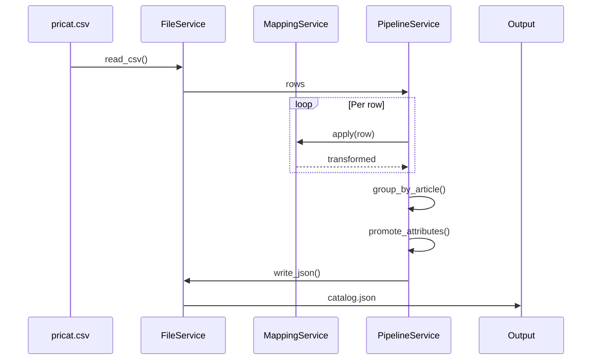
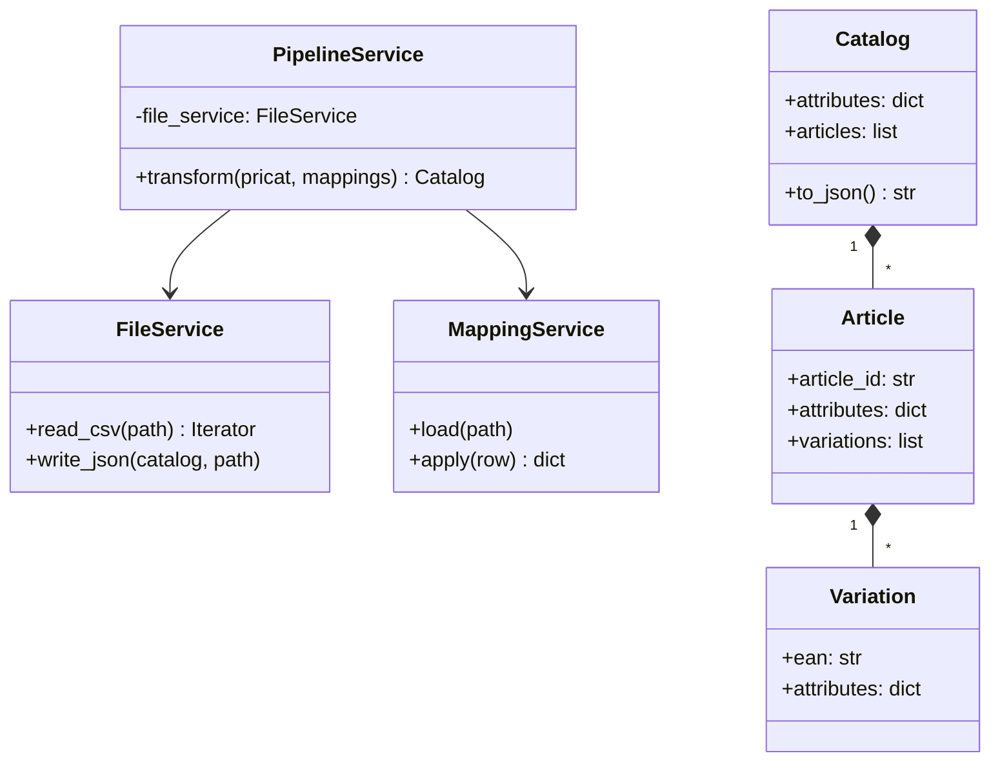

# Architecture

## Problem

Transform flat CSV catalog into hierarchical JSON (Catalog > Article > Variation).

## Data Flow

## Class Diagram

## Services

**FileService**: Handles CSV reading and JSON writing.

**MappingService**: Loads mappings and transforms field values.
- Single: `(field, value) → (dest_field, dest_value)`
- Composite: `((f1, f2), (v1, v2)) → (dest_field, dest_value)`

**PipelineService**: Orchestrates the transformation.

## Attribute Promotion

For each group of children:
1. Find attributes where all have identical values
2. Move to parent, remove from children

Never promotes: `ean`, `article_id`, `article_number`

## Processing

- **Stream**: CSV reading, row mapping
- **Batch**: Grouping, promotion (needs all siblings)

Dataset fits in memory.

## Edge Cases

- Empty values filtered
- Prices vary by material → stay at variation level
- Composite mappings use `|` delimiter
