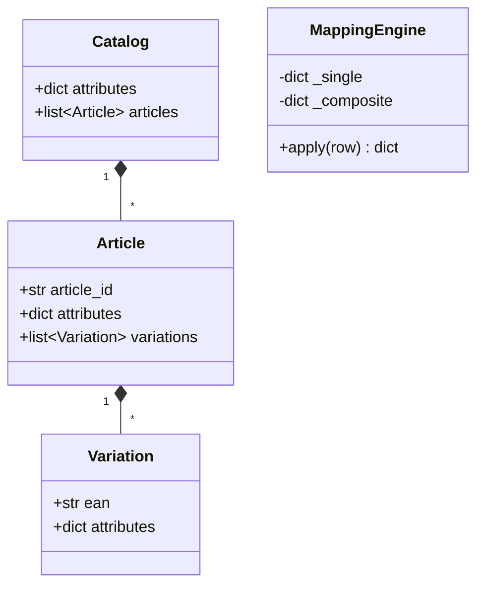
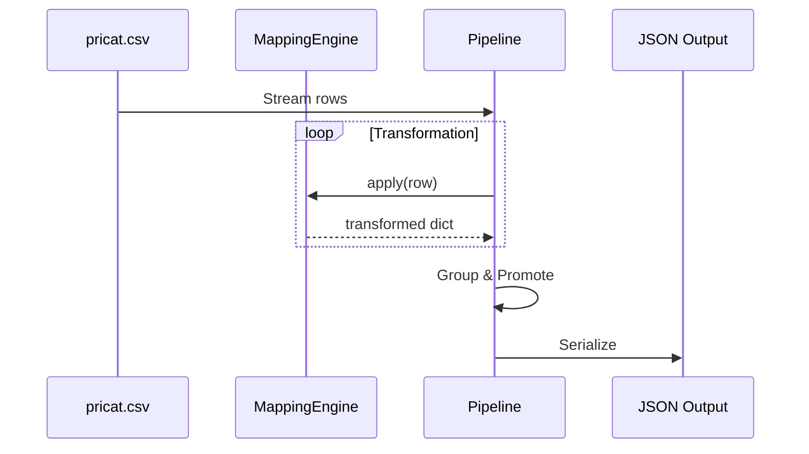

# Catalog Transformation Pipeline — Design Document

> **Senior Software Engineer Submission**  
> **Focus:** Clarity, Correctness, and Pragmatic Design.

---

## 1. Executive Summary

This solution transforms a flat CSV price catalog into a hierarchical JSON structure. It features a robust **Mapping Engine** for value normalization and an **Attribute Promotion** algorithm that optimizes the hierarchy by moving common attributes to the highest possible level (Variation → Article → Catalog).

## 2. Senior-Level Highlights

| Feature | Design Choice | Rationale |
|---------|---------------|-----------|
| **Domain Models** | Pydantic V2 | Type safety, automatic validation, and built-in serialization without boilerplate. |
| **Mapping Performance** | O(1) Hash Map Lookups | Pre-compiled mappings for both single-field and composite keys ensure efficiency regardless of catalog size. |
| **Promotion Logic** | Set-based intersections | A generic algorithm handles attribute promotion up any number of levels, correctly excluding identity fields like EAN. |
| **Processing Strategy** | Hybrid Batch/Stream | Streams row-level transformation (O(1) memory) but buffers for promotion (O(n) memory), which is functionally required to see "all children". |
| **Pragmatism** | Flat `src/` Structure | Avoided over-engineering (no unnecessary `services/` or `protocols`) while maintaining strict single-responsibility files. |

---

## 3. Architecture

### Class Design

### Transformation Flow

---

## 4. Key Implementation Details

### The Mapping Engine
The engine differentiates between **Mapped Fields** (fields explicitly defined in `mappings.csv`) and **Passthrough Fields**.
- **Rule**: If a field is in a mapping but the value doesn't match, it is **dropped** (assuming invalid data).
- **Rule**: If a field is *not* in any mapping, it is **passed through** as-is.

### Attribute Promotion Algorithm
Promotion is the "trickiest" part of the task. My algorithm works recursively:
1.  **Collect**: Gather all attributes from children.
2.  **Compare**: Find keys where the value is identical across *all* children.
3.  **Promote**: Lift those keys to the parent and remove them from the children.
4.  **Exclude**: Identity fields (EAN, article_id) are explicitly blacklisted from promotion to prevent data corruption.

### Data Edge Cases Handled
- **Empty Cells**: Stripped out entirely to keep JSON clean.
- **Price Variation**: Correctly identified that prices vary by material within some articles, keeping them at the Variation level.
- **Composite Splitting**: Handles `|` delimiters used in the mapping file for multi-column keys.

---

## 5. Tradeoffs: Stream vs. Batch

### Decision: Hybrid Approach
Because the task requires **Attribute Promotion** (knowing if *all* children share a value), true streaming of the output is impossible until the group is fully read.

- **Phase 1 (Stream)**: CSV reading and Mapping are performed per-row.
- **Phase 2 (Batch)**: Grouping and Promotion are performed in-memory.
- **Scaling**: For a 100k row catalog (~40MB), this easily fits in standard container memory (256MB+). If we reached 10M+ rows, we would implement per-article buffering using sorted inputs.

---

## 6. Testing Strategy

I prioritized high-signal tests over raw coverage:
- **Unit Tests**: Isolated Mapping Engine (single/composite) and Promotion logic.
- **Integration Tests**: Full end-to-end run using the provided `pricat.csv`, verifying that `brand` lifts to the catalog while `ean` stays at the variation.
- **Edge Case Tests**: Verified that empty CSV columns do not appear in output.

