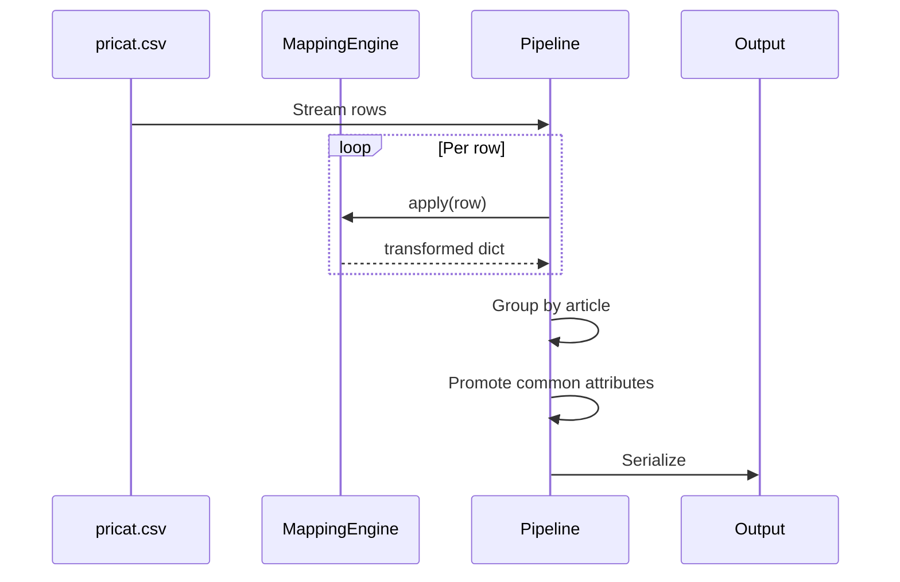
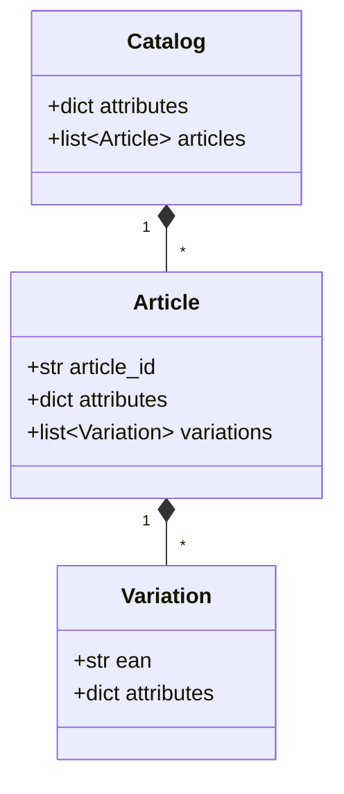

# Design Notes

## Problem

Transform flat CSV catalog into hierarchical JSON (Catalog > Article > Variation). Main challenge is deciding which attributes to promote to avoid redundancy.

## Data Flow

## Models

Using Pydantic for validation and JSON serialization.

## Mapping Engine

Reads `mappings.csv` and builds lookup tables:
- Single mappings: `(field, value) -> (dest_field, dest_value)`
- Composite mappings: `((field1, field2), (val1, val2)) -> (dest_field, dest_value)`

Fields in mappings but with no matching value get dropped. Everything else passes through unchanged if non-empty.

## Attribute Promotion

For each group of children (variations in article, articles in catalog):
1. Find attributes where all children have identical values
2. Move to parent
3. Remove from children

Never promote identity fields (ean, article_id).

Runs in two passes:
- Variations → Articles
- Articles → Catalog

## Processing Approach

Can't fully stream because promotion needs to see all siblings to find common attributes. So:
- Stream: CSV reading and row mapping
- Batch: Grouping and promotion

For the dataset size, everything fits in memory easily.

## Edge Cases

- Empty values filtered out
- Prices vary by material within articles, so stay at variation level
- Composite mappings use `|` delimiter

## Tests

- Mapping logic (single/composite)
- Promotion algorithm
- End-to-end with real data
- Edge cases (empty values, price variance)

