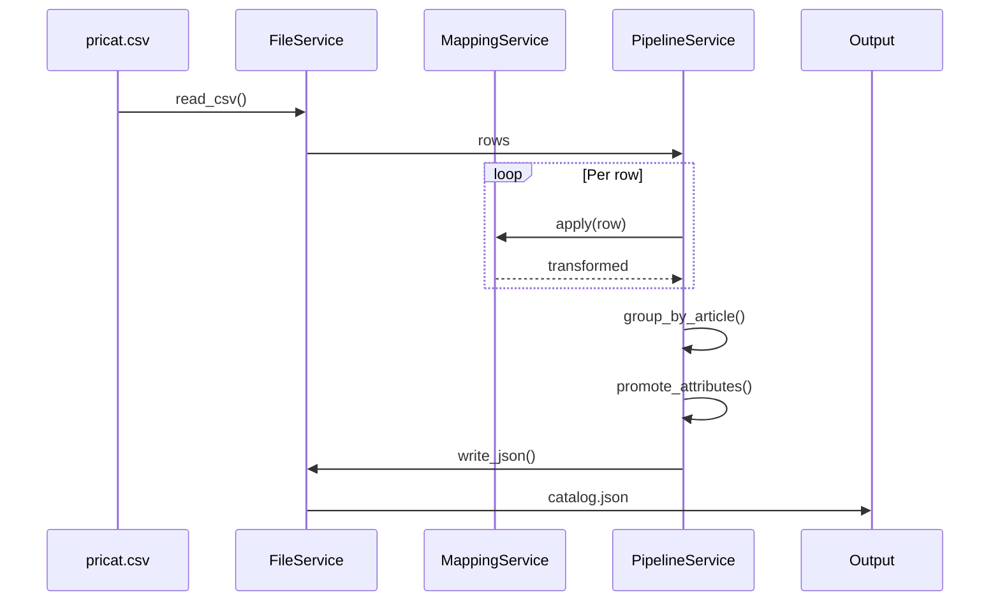
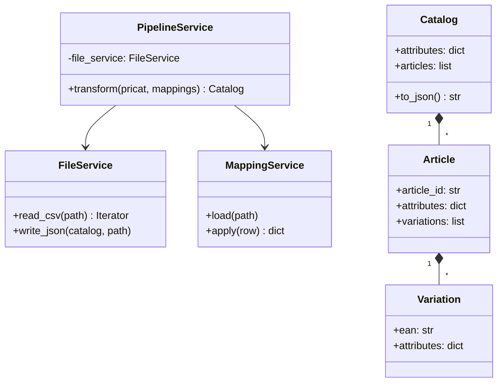

# Architecture

## Problem

Transform flat CSV catalog into hierarchical JSON (Catalog > Article > Variation).

## Data Flow



## Class Diagram



## Services

**FileService**: Handles CSV reading and JSON writing.

**MappingService**: Loads mappings and transforms field values.
- Single: `(field, value) → (dest_field, dest_value)`
- Composite: `((f1, f2), (v1, v2)) → (dest_field, dest_value)`

**PipelineService**: Orchestrates the transformation.

## Attribute Promotion

For each group of children:
1. Find attributes where all have identical values
2. Move to parent, remove from children

Never promotes: `ean`, `article_id`, `article_number`

## Processing

- **Stream**: CSV reading, row mapping
- **Batch**: Grouping, promotion (needs all siblings)

Dataset fits in memory.

## Handling Large Files

Current implementation loads all data into memory (~50 MB for 100K rows). For larger catalogs, I would implement:

### Chunked Streaming

Keep a buffer of incomplete articles and flush finished ones:

```python
article_buffer = {}
for row in csv_reader:
    article_id = row["article_number"]
    article_buffer.setdefault(article_id, []).append(row)

    if len(article_buffer) >= CHUNK_SIZE:
        yield from flush_complete_articles(article_buffer)
```

**Trade-offs:**
- Memory: 50 MB → 5 MB (configurable buffer)
- Speed: ~10% slower (incremental processing)
- Works if articles complete within buffer window

**Best for:** 1-10M rows

### Parallel Processing

Split file into chunks, process on separate CPU cores:

```python
with Pool(workers=4) as pool:
    chunks = split_by_line_count(file, 4)
    results = pool.map(process_chunk, chunks)
merge_and_promote(results)
```

**Trade-offs:**
- Memory: 4x higher (one copy per worker)
- Speed: 4x faster on 4-core CPU
- Promotion needs two passes (within chunk, then global)

**Best for:** Time-critical jobs with available RAM

### Database Grouping

Stream into SQLite, group with SQL:

```python
# Insert variations
for row in csv_reader:
    db.execute("INSERT INTO variations VALUES (?)", row)

# Group by article
articles = db.execute("""
    SELECT article_number, json_group_array(data)
    FROM variations GROUP BY article_number
""")
```

**Trade-offs:**
- Memory: constant (~1 MB)
- Speed: similar to current (SQL is efficient)
- Requires database dependency

**Best for:** >10M rows or memory-constrained environments

**My recommendation:** Start with chunked streaming (simple, works for most cases). Add database grouping only if files exceed 10M rows.

### Long-term Improvements

For production systems processing multiple catalogs simultaneously:

**Async I/O** for concurrent file reading:
```python
async def transform_async(self, files: list[Path]):
    tasks = [self._read_and_transform(f) for f in files]
    return await asyncio.gather(*tasks)
```

This allows processing multiple supplier catalogs in parallel without blocking on I/O operations. Useful when handling 10+ catalogs per batch job.

## Edge Cases

- Empty values filtered
- Prices vary by material → stay at variation level
- Composite mappings use `|` delimiter
