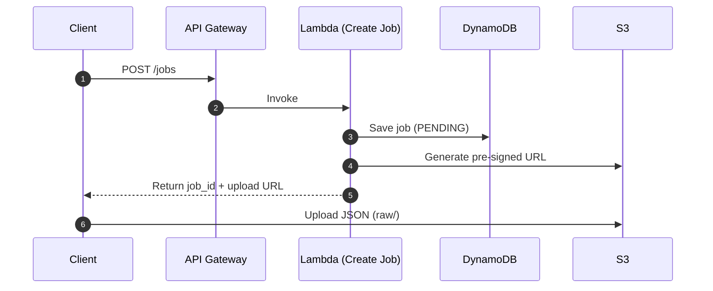
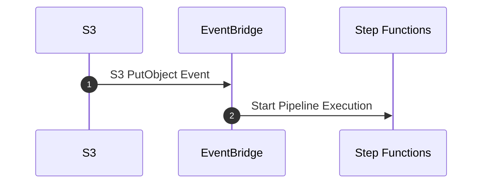
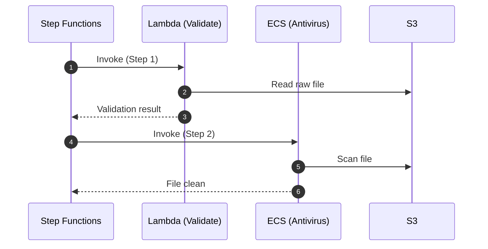
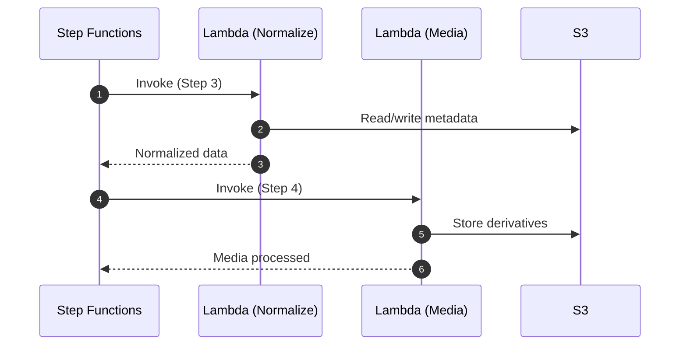
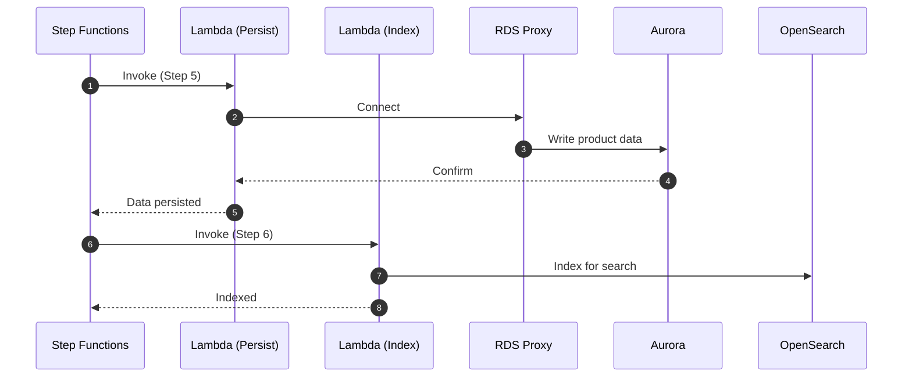
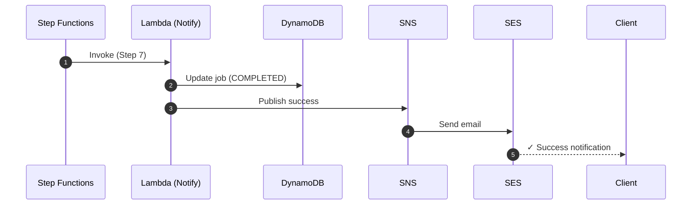
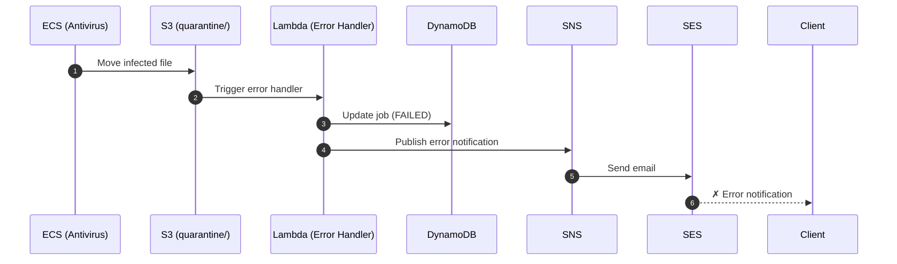

# AWS Product Import Pipeline - Sequence Diagrams

## 1. Upload Phase (Job Creation & File Upload)

---

## 2. Trigger Phase (Event-Driven Pipeline Start)

---

## 3. Validation & Antivirus

---

## 4. Normalize & Media Processing

---

## 5. Persistence & Indexing

---

## 6. Success Notification

---

## 7. Error Handling

