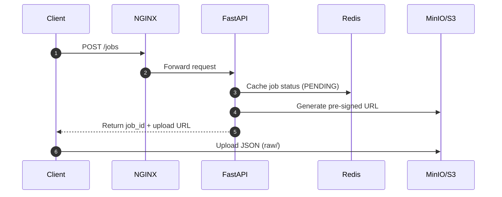
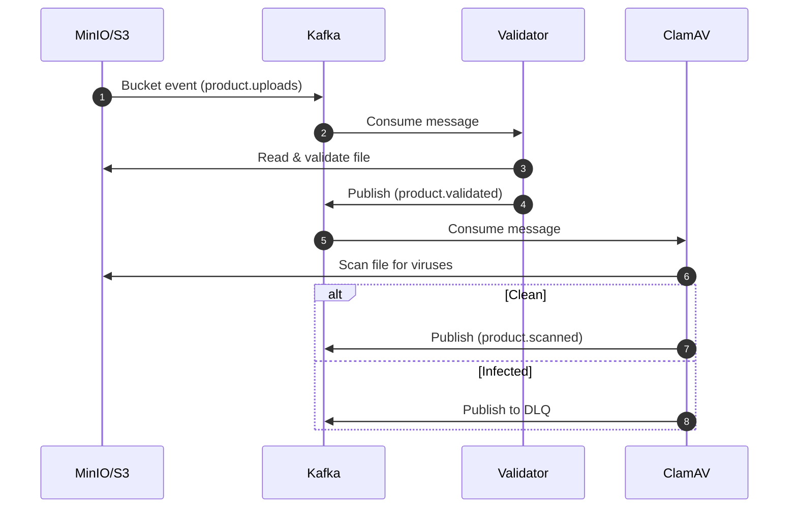
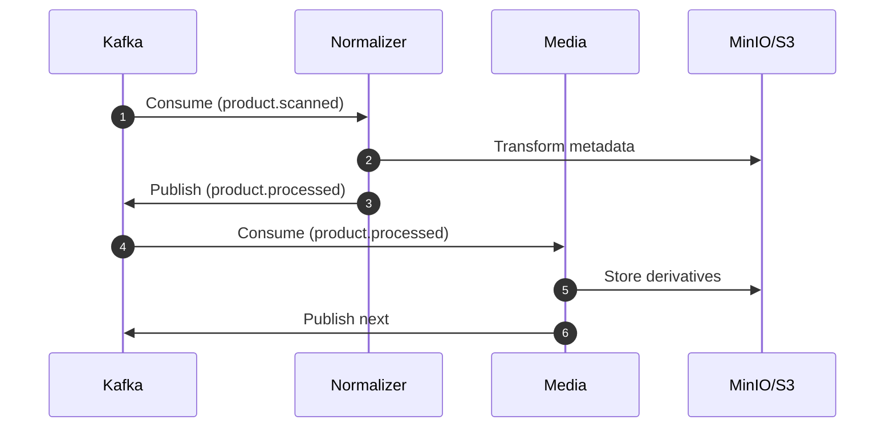
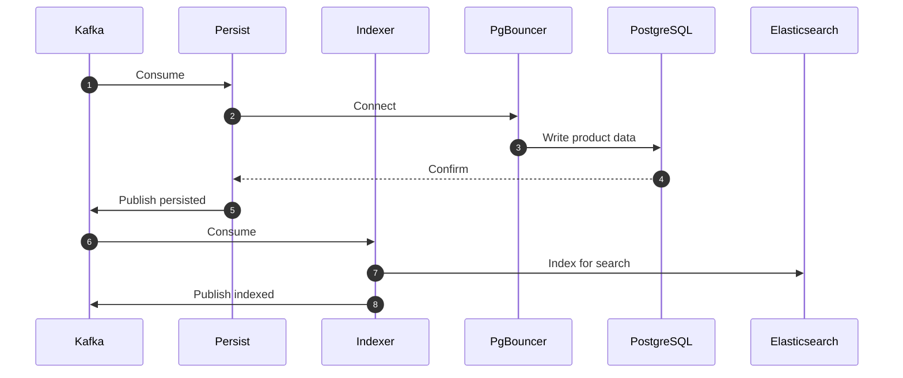
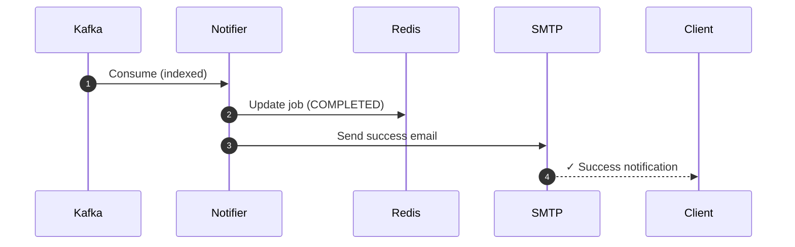
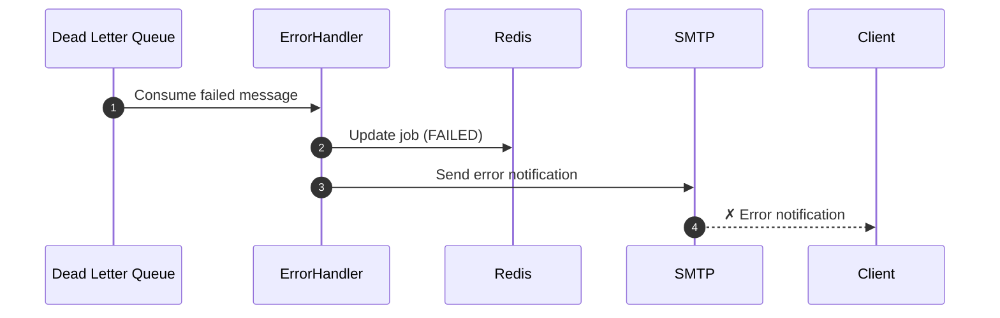

# Kafka Product Import Pipeline - Sequence Diagrams

## 1. API Layer & File Upload

---

## 2. Event Streaming & Validation

---

## 3. Processing (Normalize & Media)

---

## 4. Persistence & Indexing

---

## 5. Success Notification

---

## 6. Error Handling

